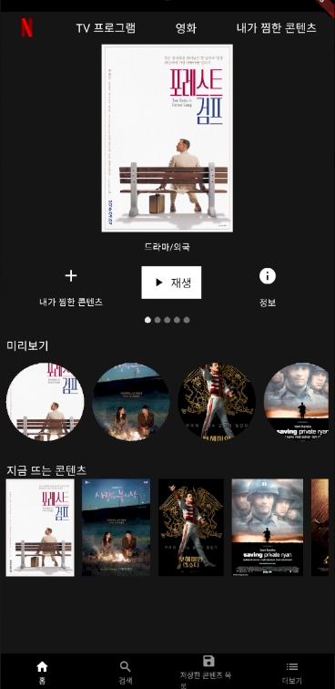
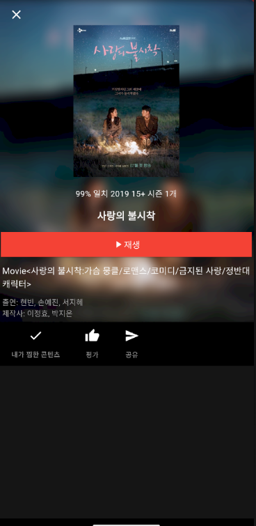
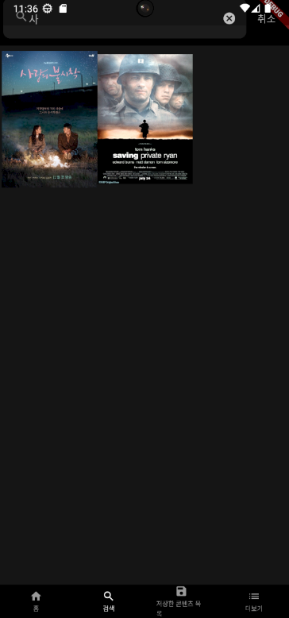
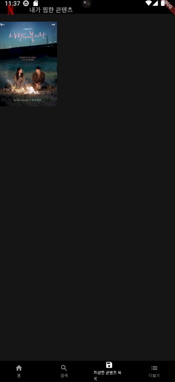
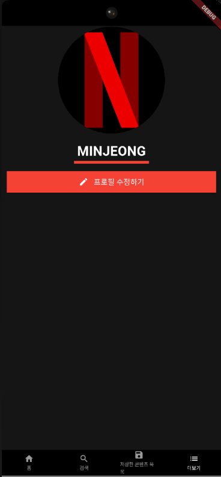

# Flutter Netflix Clone

### 학습 방식

- Flutter 기반으로 직접 UI를 구현하며 모바일 앱 구조 이해
- 화면 단위로 기능을 분리하여 개발
  - screen / widget / model 구조 설계

- 더미 데이터 → Firebase 연동으로 단계적 확장

---

### 학습출처

인프런의 강의를 기반으로 학습한 내용을 정리한 코드입니다.

- [Flutter + Firebase로 넷플릭스 UI 클론 코딩하기](https://www.inflearn.com/course/flutter-netflix-clone-app)

---

## 주요 기능

- 하단 네비게이션 기반 화면 구성
- 영화 리스트 UI (캐러셀, 원형, 박스 슬라이더)
- 영화 상세 페이지
- 검색 기능
- 찜(좋아요) 기능
- Firebase 연동을 통한 데이터 저장 및 반영

---

### 사용 기술

- Flutter
- Dart
- Firebase (Cloud Firestore)
- Carousel Slider

---

### 프로젝트 구조

```id="flutter-structure"
lib/
 ├── model
 ├── screen
 ├── widget
 └── main.dart
```

---

### 실행화면






